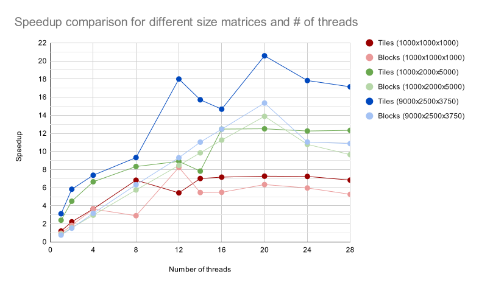

Over 10 weeks, I learned about parallel computing concepts and applied them through weekly labs and larger projects. I learned about implementing parallel algorithms in OpenMP, MPI, OpenACC, and CUDA. I completed three projects throughout the quarter which applied these topics. The code for the projects can be found on [GitHub](https://github.com/jordanmosakowski/parallel-computing)

### Project 1: Dense Matrix Multiplication (OpenMP)

This project used block and tile methods discussed in class to create a parallel implementation of a dense matrix multiplication algorithm.

Below are the results of the block and tile methods for various matrix sizes, with analysis run on 1, 2, 4, 8, 12, 14, 16, 20, 24, and 28 threads:

### Project 2: Sparse Matrix Multiplication (OpenMP)

An implementation of the accumulator sparse matrix multiplication algorithm in OpenMP.

Below are the results of the algorithm using a 10% fill factor, with analysis run on 1, 2, 4, 8, 12, 14, 16, 20, 24, and 28 threads:

### Project 3: Dijkstra's Algorithm (OpenMP and MPI)

Dijkstra’s algorithm is a way to find the shortest path between two nodes in a graph. To find such a path, it runs n-1 iterations, where n is the number of nodes in the graph. For each iteration, it finds the node that is closest to the source node that hasn’t already been updated. Then, it uses that node’s list of distances to update the source’s list of distances.

Below are the results of the OpenMP and MPI implementations of Dijkstra's Algorithm, with analysis run on 1, 2, 4, 8, 16, and 28 threads/processes:

